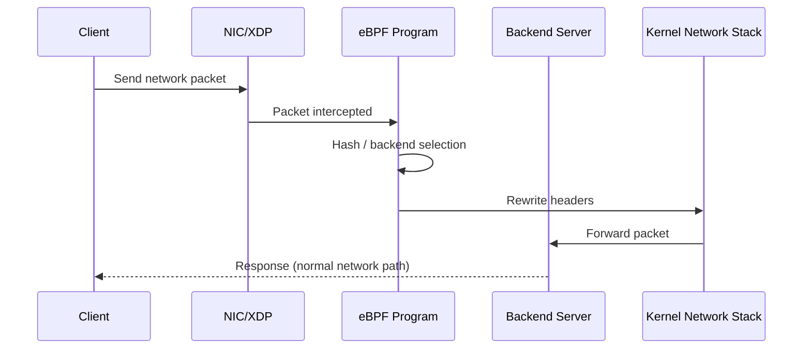

## Project description:

**eBPF Load Distributor** is an experimental **Linux kernel-level load distribution system using eBPF/XDP**.
It demonstrates how network packets can be intercepted, processed, and redirected directly inside the kernel to achieve **low-latency load balancing, efficient packet routing, and high-performance networking** without traditional user-space proxies.

The project focuses on:
* Kernel-level packet processing using **eBPF**
* High-performance networking concepts (XDP hook)
* Load distribution across backend nodes

---

## Dependencies:

Requirements to build/run this project:

* Linux system with **eBPF/XDP kernel support**
* Clang/LLVM toolchain (for compiling eBPF programs)
* libbpf / kernel headers
* Docker & Docker Compose (optional demo/test environment)
* Root privileges (required to load eBPF programs)

---

## Flow:



---

## How to run:

### 1. Clone repository

```bash
git clone https://github.com/soorya38/ebpf-load-distributor.git
cd ebpf-load-distributor
```

### 2. Setup environment (optional containerized demo)

```bash
docker-compose up -d
```

### 3. Compile & load eBPF program

```bash
sudo ./run-ebpf.sh
```
Operations performed by the scipt:
* Compiles the eBPF C program
* Attaches it to an XDP hook/interface
* Starts packet load distribution

### 4. Verify

```bash
ip link show
sudo bpftool prog show
```
The above confirms the program's attachment.

---
